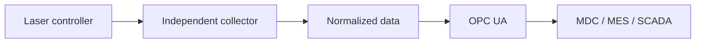

# CypCut to OPC UA Gateway

[](LICENSE)
[](#project-status)

An independent .NET gateway for exploring vendor-specific laser-controller telemetry and exposing normalized data through OPC UA.

> **Project status: Research / clean-room integration.** The repository contains an independent HTTP/JSON-to-OPC-UA prototype. A separate field observation confirmed a live CypCut/PCUI TCP channel on port `20112`; its protocol parser is **not yet part of this repository**.

[Русская версия](README-RU.md)

## Why this project exists

Industrial laser controllers often expose data through vendor-specific interfaces, while MDC, MES, SCADA, and analytics systems need stable, vendor-neutral data. This project documents and prototypes a translation layer without coupling the result to a particular monitoring platform.



## Transport scope

| Transport | Repository status | Field status |
|---|---|---|
| HTTP/JSON, example port `8080` | Implemented as a configurable prototype collector | Not claimed as field-validated here |
| CypCut/PCUI TCP, observed port `20112` | Not included; clean-room parser is planned | Live transport, frame reception, tag extraction, and CRC checking observed on a real machine |

The two ports serve different roles in the investigation. `8080` is an example configuration for the open HTTP/JSON prototype. `20112` is a separate PCUI transport observed during field work; it must not be represented as an implemented feature until the independent parser is added and tested.

## Field-validated milestone

On 2026-09-02, a separate field reference build established a live connection to a CypCut/PCUI controller over TCP `20112`.

- binary frames were received and structurally decoded;
- tag ID and value were extracted;
- CRC validation succeeded;
- one observed run processed 14,892 frames with 0 CRC errors;
- normalized diagnostic output contained `NcState.SysState = 1` and a valid `Protocol20112` diagnostic block.

This is evidence that the lower-level communication path exists. It does **not** yet validate the semantic mapping of machine states such as idle, run, pause, alarm, or cutting.

See [docs/FIELD-VALIDATED-MILESTONE.md](docs/FIELD-VALIDATED-MILESTONE.md) and [docs/PUBLIC-RELEASE-SCOPE.md](docs/PUBLIC-RELEASE-SCOPE.md).

## Included prototype capabilities

- one configurable Windows service for multiple machines;
- per-machine enable/disable switch;
- configurable HTTP source address, source port, route, polling interval, and OPC UA port;
- one OPC UA endpoint per enabled machine;
- JSON mapping into a structured OPC UA address space;
- configuration validation and self-test commands;
- console mode for commissioning and Windows Service mode for deployment.

## Example topology

All addresses in this repository use documentation-only network `192.0.2.0/24`.

| Machine | HTTP/JSON prototype source | OPC UA output |
|---|---|---|
| Laser 01 | `http://192.0.2.101:8080/...` | `opc.tcp://192.0.2.10:4880/CypCut/laser-01` |
| Laser 02 | `http://192.0.2.102:8080/...` | `opc.tcp://192.0.2.10:4881/CypCut/laser-02` |

## Build and test

Requirements: .NET 8 SDK on Windows or Linux.

```powershell
dotnet restore .\src\CypCutOpcUaGateway\CypCutOpcUaGateway.csproj
dotnet build .\src\CypCutOpcUaGateway\CypCutOpcUaGateway.csproj -c Release
dotnet run --project .\src\CypCutOpcUaGateway -- --self-test
dotnet run --project .\src\CypCutOpcUaGateway -- --validate-config
```

## Project status

Completed in the open prototype:

- standalone HTTP/JSON collector and normalized OPC UA model;
- configuration and JSON-mapping self-tests;
- multi-endpoint runtime smoke testing;
- Windows Service scripts.

Confirmed separately in field work:

- live PCUI TCP `20112` connection;
- binary frame reception and CRC validation;
- preliminary tag extraction.

Next work:

- [ ] implement a clean-room TCP/20112 parser without copying legacy binaries or source;
- [ ] validate frame format with independently captured, anonymized samples;
- [ ] map confirmed tag/value combinations to physical machine states;
- [ ] validate OPC UA subscriptions during a cutting cycle.

## Public-release safety boundary

This repository intentionally excludes:

- any proprietary monitoring-platform integration, protocol preset, URL, or identifier;
- customer names, production data, machine serial numbers, and private IP addresses;
- legacy adapter binaries, configuration files, logs, and documentation;
- code copied or derived from closed-source components.

The source in this repository is an independent implementation. Product names are used only to describe interoperability. This project is not affiliated with or endorsed by CypCut or any monitoring-platform vendor.

## Security

Do not expose OPC UA endpoints or controller networks to the public internet. Use a segmented industrial network, least-privilege access, certificates, and access controls before production use. See [SECURITY.md](SECURITY.md).

## Engineering context

This is a portfolio project about practical industrial connectivity: observing an unknown machine interface, separating evidence from assumptions, and normalizing trustworthy data for manufacturing systems.

Author: Viktor Matskevich — Industrial AI, machine connectivity, and intelligent systems for the physical world.
