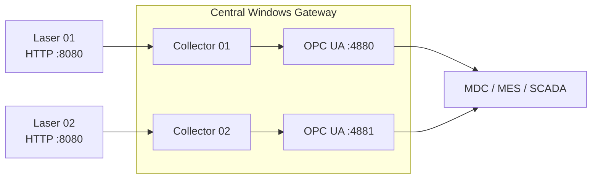

# CypCut to OPC UA Gateway

[](https://github.com/Viktor-Matskevich/cypcut-opcua-gateway/actions/workflows/build.yml)
[](LICENSE)
[](#project-status)

An independent Windows gateway that polls configurable CypCut data endpoints and
exposes each enabled laser machine through its own OPC UA endpoint.

> **Project status: Experimental — field validation pending.**
>
> The build, JSON mapping, configuration validation, and simultaneous startup of
> ten OPC UA endpoints have been tested. The data route must still be validated
> against the specific CypCut installation used on a real machine.

[Русская версия](README-RU.md)

## Why this project exists

Laser machines often expose vendor-specific data while MDC, MES, SCADA, and
analytics platforms expect a standard industrial interface. This gateway creates
a configurable translation layer without coupling the machine to a particular
monitoring platform.



## Key capabilities

- One central Windows service for multiple laser machines.
- Per-machine `Enabled=true/false` switch.
- Configurable source IP, source port, OPC UA port, polling interval, and route.
- A separate OPC UA endpoint for every enabled machine.
- 78 known process variables plus 9 identity and diagnostic variables.
- Original response preserved in `Connection/RawJson`.
- OPC UA quality status for missing or stale values.
- Console mode for commissioning and Windows Service mode for production.
- No external cloud or monitoring-server dependency.

## Example topology

The repository uses the documentation-only network `192.0.2.0/24`. Replace all
example addresses before deployment.

| Machine | CypCut source | OPC UA output on gateway |
|---|---|---|
| Laser 01 | `192.0.2.101:8080` | `opc.tcp://192.0.2.10:4880/CypCut/laser-01` |
| Laser 02 | `192.0.2.102:8080` | `opc.tcp://192.0.2.10:4881/CypCut/laser-02` |

## Configuration

Set the central server address in `config/gateway.json`:

```json
{
  "name": "CypCut-Standalone-Gateway",
  "publishedIp": "192.0.2.10",
  "pkiDirectory": "pki",
  "requestTimeoutMs": 3000
}
```

Register machines in `config/machines.csv`:

```csv
Enabled,Id,Name,CypCutIp,CypCutPort,OpcUaPort,EndpointPath,PollIntervalMs,AppName
true,laser-01,Laser 01,192.0.2.101,8080,4880,/api/monitor/cutSystemState?ip={ip}&appName={appName},1000,CypCut
false,laser-02,Laser 02,192.0.2.102,8080,4881,/api/monitor/cutSystemState?ip={ip}&appName={appName},1000,CypCut
```

`publishedIp` must belong to a network interface on the central server. Every
enabled machine must use a unique `Id` and `OpcUaPort`.

## Build and test from source

Requirements: Windows or Linux with the .NET 8 SDK.

```powershell
dotnet restore .\src\CypCutOpcUaGateway\CypCutOpcUaGateway.csproj
dotnet build .\src\CypCutOpcUaGateway\CypCutOpcUaGateway.csproj -c Release
dotnet run --project .\src\CypCutOpcUaGateway -- --self-test
dotnet run --project .\src\CypCutOpcUaGateway -- --validate-config
```

## Windows release workflow

The packaged Windows release contains the runtime and four launch commands:

| Command | Purpose |
|---|---|
| `RUN-01-VALIDATE.cmd` | Validate files, configuration, source ports, and internal mapping. |
| `RUN-02-START-CONSOLE.cmd` | Run interactively and show connection errors during commissioning. |
| `RUN-03-INSTALL-SERVICE.cmd` | Install and start the automatic Windows service. Run as Administrator. |
| `RUN-04-UNINSTALL-SERVICE.cmd` | Remove the Windows service and its firewall rules. |

Recommended sequence: configure → validate → console test → OPC UA client test →
install service.

## OPC UA information model

Each endpoint contains one machine with these folders:

- `Identity` — machine ID, name, source address, and ports.
- `Connection` — connectivity, last update, last error, and raw response.
- `State` — general state fields.
- `NcState` — coordinates, program execution, speed, power, and I/O.
- `DeviceState` — Z/height, gas, laser, following, and PWM state.
- `GlobalParams` — machine-level motion and process parameters.

See [docs/PARAMETERS.md](docs/PARAMETERS.md) for the complete 87-node catalog.

## Project status

Completed:

- clean standalone implementation;
- configuration and JSON-mapping self-tests;
- one-machine runtime smoke test;
- ten-machine concurrent OPC UA endpoint test;
- PowerShell syntax validation;
- Windows Service installation scripts.

Pending field validation:

- confirm the configured data route on a real CypCut installation;
- capture an anonymized response sample;
- verify which of the 78 process fields are populated by that version;
- validate subscriptions from UaExpert or an MDC client during a cutting cycle.

The field procedure is documented in [docs/FIELD-VALIDATION.md](docs/FIELD-VALIDATION.md).

## Independence and trademark notice

This is an unofficial, independent integration project. It is not affiliated
with, endorsed by, or maintained by the developer of CypCut. It contains no
proprietary application binaries or closed source code. Product names are used
only to describe interoperability.

## Security

The initial commissioning profile allows anonymous OPC UA access and
`Security=None`. Do not expose the gateway to the public internet. Use a
segmented industrial network and configure certificates and access controls
before production deployment. See [SECURITY.md](SECURITY.md).

## Engineering context

This project demonstrates practical industrial connectivity: converting
machine-specific telemetry into a stable, vendor-neutral interface that can be
consumed by manufacturing intelligence systems.

Author: **Viktor Matskevich** — Industrial AI, machine connectivity, and
intelligent systems for the physical world.
